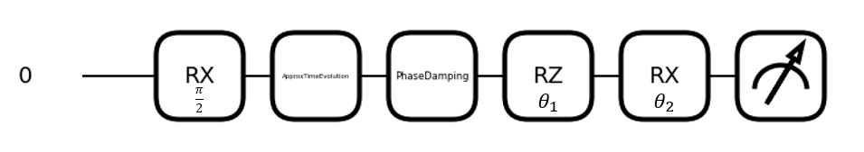

# Revised version of quantum optimization (WIP)

  


***
Here contains code about optimizing quantum circuit for quantum metrology.

Below is an example of 1-qubit circuit to be optimized.



This repository is the revised version of [original source code](https://github.com/iridescent0923/Quantum_Optimization/tree/main) written by [iridescent0923](https://github.com/iridescent0923)

Currently optimizing a single-qubit circuit is available only.

***

# How to run the program

### 1. Clone this repository
```
git clone https://github.com/kist-qeg/revised_optimization.git
```

### 2. Install necessary packages via below command line

```
pip install -r requirements.txt
```

### 3. configure arguments in YAML file (below is an example)

```yaml
num_qubit: 1            # number of qubits in circuit

freq: 4.0e+5            # detuning frequency

t2: 8.0e-5              # T2* dephasing time

gamma: 0.0              # post-selection factor

t_obs: 8.0e-6           # time interval to observe

num_points: 80          # number of timepoints in the interval

opt: 'LBFGS'            # optimization method (LBFGS or Adam)

steps_per_point: 500    # maximum optimization steps per timepoint

patience: 5             # maximum patience limit

threshold: 1.0e-7       # patience threshold

save_to: 'test.npy'     # file path to save data
```

##### Descriptions about arguments

- **num_qubit:** Determines number of qubits in the circuit.

- **freq:** Detuning frequency. This argument determines CFI's speed of oscillation, while vanished by parameter optimization.

- **t2:** Dephasing time. This argument determines the speed of dephasing. The smaller, the faster.

- **gamma:** Post-selection factor, ranged from 0 to 1, which determines rate of post-selection.

- **t_obs:** Time length to observe.          

- **num_points:** number of time points in t_obs to observe
  
- **opt:** Optimization method. Currently 'LBFGS' and 'Adam' are available.

- **steps_per_point:** Maximum optimization steps per time point.

- **patience:** Maximum patience count of optimization. Early stopping is activated if CFI's amount of change is consecutively smaller than threshold for "patience count" times

- **threshold:** Determines precision of optimization. The smaller threshold is, the better it optimizes, but it could lengthen the total running time.

- **save_to:** File path to save result data.

### 4. Run below command line

```
python main.py [config file's name (.yaml)]
```

***

# TODO

- Improvements of data visualization
- 2,3,4-qubit circuit update
- Add test results in README
- ~~Add notebook tutorial~~